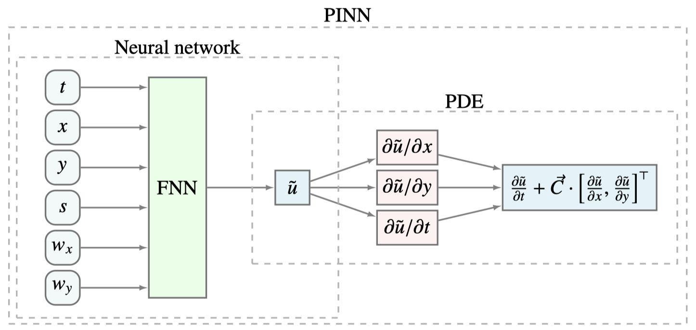
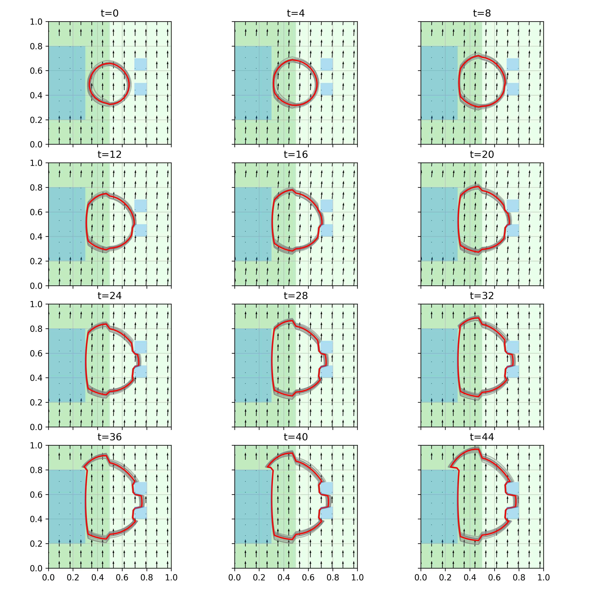

<font size=7> Bayesian Physics Informed Neural Networks for Data Assimilation and Spatio-Temporal Modelling of Wildfires </font>


This code implements the Bayesian Physics Informed Neural Network (PINN) for 
modelling a wildfire fire-front as it progresses over space and time as 
described in the following paper:

>Joel Janek Dabrowski, Daniel Edward Pagendam, James Hilton, Conrad Sanderson, 
    Daniel MacKinlay, Carolyn Huston, Andrew Bolt, Petra Kuhnert, "Bayesian 
    Physics Informed Neural Networks for Data Assimilation and Spatio-Temporal 
    Modelling of Wildfires", Spatial Statistics, Volume 55, June 2023, 100746
    
Links: <br>
Published: https://www.sciencedirect.com/science/article/pii/S2211675323000210 <br>
Preprint: https://arxiv.org/abs/2212.00970

BibTex citation:
```bibtex
@article{DABROWSKI2023100746,
title = {Bayesian Physics Informed Neural Networks for data assimilation and spatio-temporal modelling of wildfires},
journal = {Spatial Statistics},
volume = {55},
pages = {100746},
year = {2023},
issn = {2211-6753},
doi = {https://doi.org/10.1016/j.spasta.2023.100746},
url = {https://www.sciencedirect.com/science/article/pii/S2211675323000210},
author = {Joel Janek Dabrowski and Daniel Edward Pagendam and James Hilton and Conrad Sanderson and Daniel MacKinlay and Carolyn Huston and Andrew Bolt and Petra Kuhnert},
keywords = {PINN, B-PINN, Level-set method, Uncertainty quantification, Neural network, Variational inference},
abstract = {We apply the Physics Informed Neural Network (PINN) to the problem of wildfire fire-front modelling. We use the PINN to solve the level-set equation, which is a partial differential equation that models a fire-front through the zero-level-set of a level-set function. The result is a PINN that simulates a fire-front as it propagates through the spatio-temporal domain. We show that popular optimisation cost functions used in the literature can result in PINNs that fail to maintain temporal continuity in modelled fire-fronts when there are extreme changes in exogenous forcing variables such as wind direction. We thus propose novel additions to the optimisation cost function that improves temporal continuity under these extreme changes. Furthermore, we develop an approach to perform data assimilation within the PINN such that the PINN predictions are drawn towards observations of the fire-front. Finally, we incorporate our novel approaches into a Bayesian PINN (B-PINN) to provide uncertainty quantification in the fire-front predictions. This is significant as the standard solver, the level-set method, does not naturally offer the capability for data assimilation and uncertainty quantification. Our results show that, with our novel approaches, the B-PINN can produce accurate predictions with high quality uncertainty quantification on real-world data.}
}
```


# Overview

The PINN architecture is illustrated in the following figure
<!--  -->


The model inputs include the time `t`, the spatial location `(x,y)`, the 
fire-front speed `c`, and the wind speed `w_x` and `w_y` in the x- and 
y-directions respectively. The Bayesian Feed Forward Neural Network (FNN) 
outputs the level set function `u` where the zero level set of `u` describes the 
predicted position of the fire-front. The partial derivatives of `u` with 
respect to space and time are computed using automatic differentiation. These 
partial derivatives are used to formulate the level set equation, which is used 
as the part of the PINN's cost function. The loss function is represented in the 
form of a posterior distribution which is approximated using variational 
inference.

In this code, the results for the complex shape synthetic dataset are reproduced 
from the paper. The synthetic dataset described in section 4.1.2 of the paper 
and the results described in section 4.1.5 and figure 6 in the paper. The 
synthetic dataset describes a space comprising three obstacles that the 
fire-front can not propagate over, a time varying wind speed which follows a 
random walk in the positive y-direction, and a fire-front speed which is higher 
in the left half of the space than the right half. 

The fire-front predicted by the trained model is illustrated in the below figure



The blue regions indicate the obstructions (e.g., water); the green 
regions indicate burnable land with the darker green having a higher fire-front 
speed properties than the lighter green region; the red isochrone plots the mean 
value of the prediction from the Bayesian PINN; and the grey isochrones plot 
samples from the Bayesian PINN. 

Please see the paper for further details.

# Code Contents and Running Instructions

The file contents of this code repository are as follows:

| **File** | **Description** |
| --- | --- |
| `main.py`     | The main file to train the PINN and reproduce the results from the paper. |
| `dataset.py`  | Functions and utilities for generating the level set function and dataset samples. |
| `pinn.py`     | Defines the PINN model. |
| `mlp.py`      | Defines the Bayesian Feed Forward Neural Network (FNN). |

The `main.py` can be used to reproduce the results such as those illustrated in 
the above figure. In lines `30-34`, the training parameters may be set and these 
parameters are described in the following table:

| **Parameter** | **Description** |
| --- | --- |
| `train_model`       | If set to True, the model is trained, otherwise the model is only evaluated and plots are produced. Note the model must be trained at least once to produce the model parameters that are required for evaluation (see `save_file` below). |
| `n_epochs`          | Number of epochs to train over. This is currently set to `16000`. |
| `learning_rate`     | Learning rate used for the ADAM optimiser. This is currently set to `1e-3` |
| `predictive_cost`   | If set to True, the Forecast Likelihood described in the paper is used. |
| `save_file`         | The path to the file in which the PINN model parameters are stored. |


# Installation

This code is run on Python version `3.10.9`. This code and the required Python 
packages can be installed using the following:

```bash
git clone https:...
pip install -r requirements.txt
```